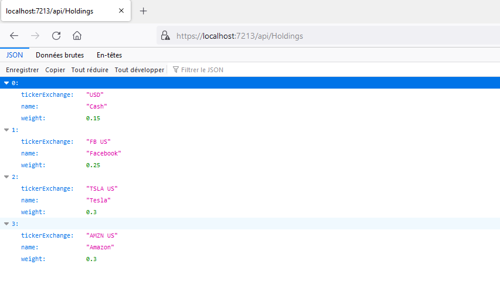
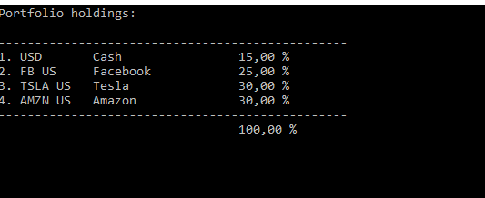
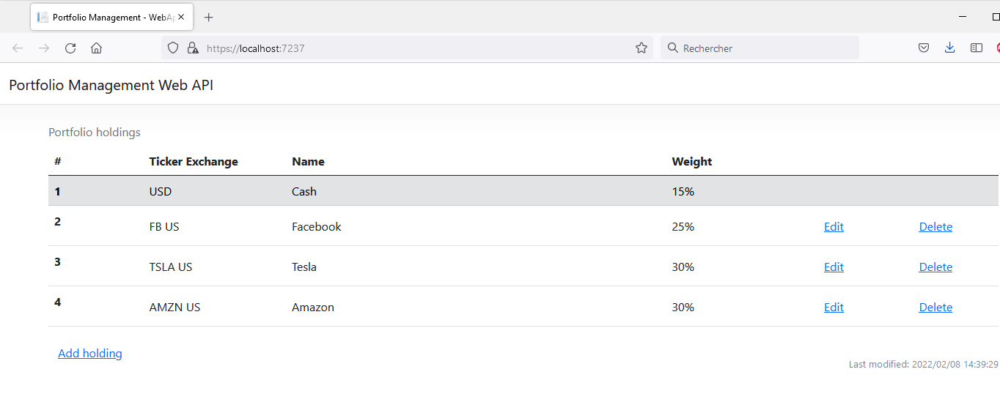
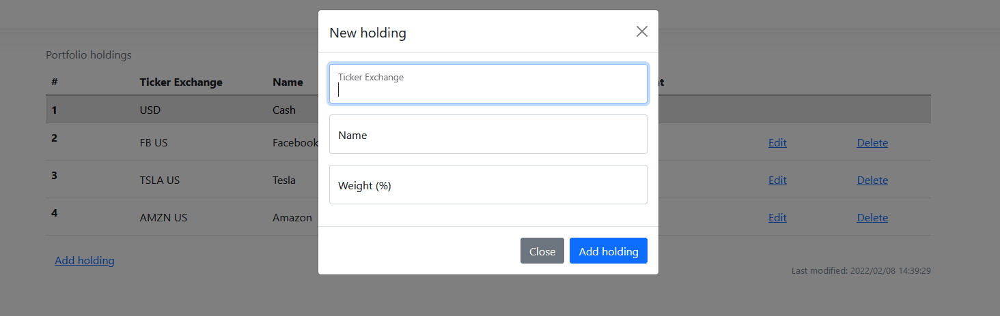
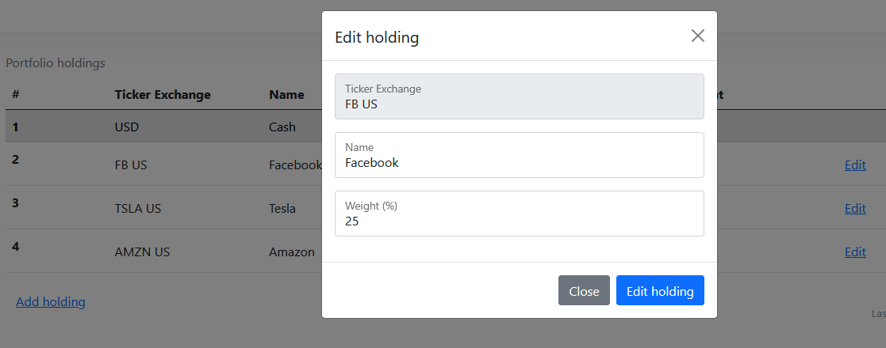
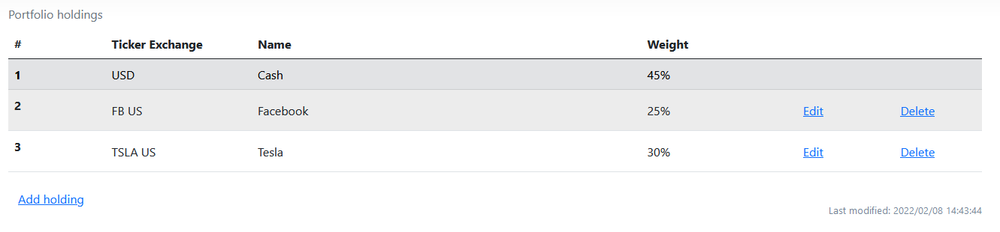

# Portfolio Management Web API

The goal of this project was to learn ASP.NET Web API 2.

The API allows the management of a investment portfolio by making it possible to view, add, modify or delete holdings.

Here is an example of the result of the call to the method that allows you to view the holdings of the portfolio:

To test the API, a console application has been developed to connect to the API to display the holdings:

A web application has also been developed to test all possible calls to the API (GET, POST, PUT, DELETE):

When adding a new holding, the API make sure that there is enough cash and that the holding does not exist in the portfolio, otherwise an error message is displayed. If we add the new holding, the level of cash is automatically adjusted:

After deleting Amazon, we see that the cash weight has been updated automatically:

Finally, the project also made it possible to test the use of an ActionFilter which is executed after each action to update the last modification date.